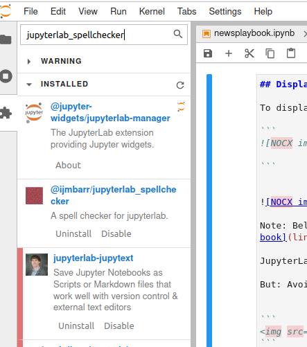

# JupyterLab extensions

Some issues you might face using JupyterLab are excellent solved by an extension.
Installing an extension with JupyterLab is since version 3 possible using the web interface only.

This means that nodejs or CLI installation activities to use an extension is no longer needed.


## Using code-snippets in your notebook

JupyterLab Code Snippets allows you to create and store code snippets that can be inserted into any JupyterLab notebook. Code snippets are pieces of code or individual cells that are frequently used. 

This extension provides a way to simply browse or search snippets in to use in JupyterLab.

To reuse code from other notebooks fast you should:

* Install JupyterLab Code Snippets extension. (see the extension installation option in Jupyter lab, search for `jupyterlab-code-snippets` )


Full documentation: https://jupyterlab-code-snippets-documentation.readthedocs.io/en/latest/index.html

## Spell checking

Notebooks can contain a lot of text. Finding typos fast is easy when using a spell checker.

Use this spellchecker for jupyterlab notebooks to check text in markdown cells.
Name of this extension:
`@ijmbarr/jupyterlab_spellchecker`



This is the best spell checker intergrated with JupyterLab that is available. A good grammar checkers that works without sending data to a cloud service is not available.


This spell checker extension provides (Hunspell) SCOWL dictionaries for American, British, Canadian, and Australian English.

The easiest way for installing this extension is to run **in the correct** environment created for JupyterLab:

```python
pip install jupyterlab-spellchecker
```

See: https://github.com/jupyterlab-contrib/spellchecker  for details and to contribute to this plugin.


## SQL solution 

SQL databases often hold data that you want to have in a notebook for developing experiments.

xeus-sql is a Jupyter kernel that makes it easy to run SQL queries for use in a JupyterLab environemtn.

xeus-sql is a general-purpose database access tool for JupyterLab. It provides you with simpel way to make SQL queries on many different databases.

You can use it by default on:
*    DB2
*    MySQL
*   ODBC databases
*    Oracle
*    PostgreSQL
*    SQLite

Installation of this add-on:
```
conda install xeus-sql jupyterlab -c conda-forge
```

More information, see the documentation: https://xeus-sql.readthedocs.io/en/latest/

Or improve the code on: https://github.com/jupyter-xeus/xeus-sqlite 


